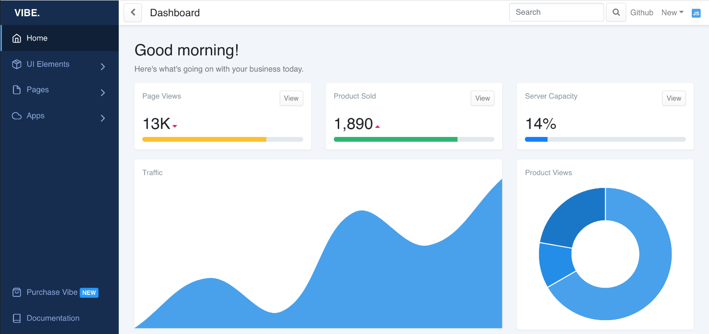

    

Vibe is a beautiful React.js dashboard build with Bootstrap 4 and
comes with lots of custom templates and components. It uses Sass
which allows you to quickly change global colors and styles.

### Quick Start

- Install dependencies by running `yarn` or `npm install`.
- Run `yarn start` or `npm run start` to start the local dev server.

### Updating styles

Sass files can be found in `./src/vibe/scss`.
Update `./src/vibe/scss/components/vars.scss` to change global styles.

### Reporting Issues

Report any issues you may find with Vibe on the github
issues tab. I will get an update to you as soon as possible. Feel free
to open a pull request and I will review and merge.
